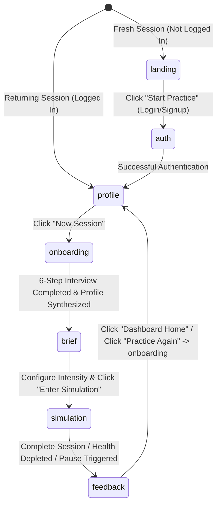

# Groundwork: Architecture & Technical Reference Blueprint

This technical guide provides a deep-dive reference blueprint of the Groundwork platform architecture, state management patterns, AI models, custom hooks, and safety guardrails. It is designed for engineers seeking to maintain, scale, or debug the platform.

---

## 1. Core State Machine & App Stage Flow

Groundwork is constructed as a high-performance single-page application (SPA) centered around a single source of truth in [App.jsx](file:///c:/Users/patil/Downloads/complete-course/groundwork/src/App.jsx). 

### State Machine Lifecycle
The user progresses through six distinct application states. The transition logic is mapped in the state diagram below:



### Global Application State & Supabase Integration
The application's core driver is the `appState` object, structured as follows in `App.jsx`, which syncs tightly with a Supabase PostgreSQL backend:

```javascript
const [appState, setAppState] = useState({
  phase: "landing", // "landing" | "profile" | "onboarding" | "coaching" | "simulation" | "feedback"
  userProfile: {
    whoAreYou: "",
    practiceGoal: "",
    scenario: "",             // Mapped to 1 of 8 predefined archetypes
    actualSituation: "",      // Captured in step 6 (Golden context)
    practicePhase: 1,         // Level of coaching support: 1 (High) | 2 (Medium) | 3 (None)
    powerDynamic: "Equal",    // Calibration: "Junior/Associate" | "Peer" | "Manager/Supervisor"
    stressLevel: 50,          // Calibration: 0 - 100
    counterpartDisposition: "Neutral", // Calibration: "Receptive" | "Neutral" | "Defensive" | "Hostile"
  },
  persona: null,              // Generated AI counterpart metadata
  conversationHistory: [],    // Cumulative messages exchanged during active simulation
  turnCount: 0,
  feedbackResult: null,       // Instantiated feedback analysis
  feedbackRating: null,       // User-reported score (Helpful / Not Quite)
  feedbackReason: "",         // Qualitative reason for feedback rating
});
```

### Navigational Security & Guards
1. **Authentication Gate (`AuthScreen`)**: A Supabase-backed authentication modal gates all routes except the landing page. The application uses row-level security (RLS) to ensure users can only read/write their own `user_profiles`, `sessions`, and `conversation_turns`.
2. **API Key Presence**: Checked on mount. If `VITE_GROQ_API_KEY` is not present in local environment variables or `sessionStorage`, the `ApiKeyModal` forces calibration.

### Database Schema (Supabase)
The application relies on three core relational tables:
1. `user_profiles`: Stores the 6-step onboarding profile context.
2. `sessions`: Tracks individual simulation events and aggregated metrics (duration, feedback).
3. `conversation_turns`: Stores real-time simulation memory, mapping every LLM and user exchange sequentially to power contextual awareness across reloads.

---

## 2. Deployment Architecture (Render)

Groundwork is configured for deployment as a **Static Site** on Render, directly linked to the repository's `main` branch.
- **Build Command**: `npm run build`
- **Publish Directory**: `dist`
- **Environment Variables**: Supabase credentials (`VITE_SUPABASE_URL`, `VITE_SUPABASE_ANON_KEY`) are injected at build-time via the Render dashboard.

---

## 2. LLM & Speech Engines

Groundwork interfaces with the **Groq API Cloud** for ultra-low latency inference, prioritizing conversational speed to simulate the natural pacing of high-stakes verbal interactions.

### Unified Generation with Failover Chain (`aiClient.js`)
All AI-powered tasks are processed through a robust failover chain defined in [aiClient.js](file:///c:/Users/patil/Downloads/complete-course/groundwork/src/utils/aiClient.js). The module cycles through models sequentially in case of rate limits (`429`) or upstream timeouts:

| Priority | Model Identifier | Purpose / Characteristics |
| :--- | :--- | :--- |
| **Primary** | `llama-3.3-70b-versatile` | High-fidelity logic, context comprehension, and character performance. |
| **Fallback 1** | `qwen/qwen3-32b` | Rapid reasoning backup. |
| **Fallback 2** | `llama-3.1-8b-instant` | Lowest latency backup. |
| **Fallback 3** | `groq/compound-mini` | Recovery/minimal capabilities baseline. |

### Speech-to-Text Integration
Speech input is transcribed dynamically in [useWhisperInput.js](file:///c:/Users/patil/Downloads/complete-course/groundwork/src/hooks/useWhisperInput.js) using the `whisper-large-v3-turbo` model. 
- Audio is packaged as a standard `FormData` file payload (`file`, `recording.webm` / `.ogg` / `.mp4`).
- It is posted directly to the transcription endpoint: `https://api.groq.com/openai/v1/audio/transcriptions`.

---

## 3. Stance Calibration & Persona Generation

### Career Context Onboarding Synthesis
[useOnboardingChat.js](file:///c:/Users/patil/Downloads/complete-course/groundwork/src/hooks/useOnboardingChat.js) guides the user through 6 targeted questions (Conversation Type, Goal, Blockers, Confidence, Desired Outcome, and Actual Scenario). 

Upon completing Step 6, the `SYNTHESIS_SYSTEM_PROMPT` instructs `robustGenerate` to structure the qualitative text inputs into a unified user profile matching this JSON schema:

```json
{
  "summary_message": "An empathetic response summarizing their answers",
  "whoAreYou": "User's current role",
  "practiceGoal": "User's goal",
  "scenario": "Salary Negotiation | Asking for a Promotion | Giving Difficult Feedback | Conflict with a Peer | Disagreeing with a Manager | Delivering Bad News | Client Negotiation | Setting a Boundary",
  "relationshipContext": "Manager, Peer, etc.",
  "communicationFear": "Specific blocker identified",
  "actualSituation": "Raw text describing their specific challenge",
  "experienceLevel": "never | tried_failed | regular_but_costly"
}
```

### Dynamic Persona Generation (`personaEngine.js`)
When onboarding is finalized, [personaEngine.js](file:///c:/Users/patil/Downloads/complete-course/groundwork/src/utils/personaEngine.js) generates a tailored opponent persona. It targets the user's specific fears (e.g., if the user fears being dismissed, it crafts a highly busy, distracted, or dismissive character).

```json
{
  "scenarioSelected": "Asking for a Promotion",
  "name": "Jordan Carter",
  "role": "Senior VP of Engineering",
  "avatarInitial": "J",
  "avatarColor": "#C86060",
  "personality": "Defensive",
  "personalityDescription": "Jordan reacts quickly to preserve status and budget limitations. Expect brief, skeptical responses.",
  "backstory": "Jordan has managed this team for three years and is protective of headcount budgets.",
  "conversationType": "Asking for a Promotion",
  "openingLine": "I saw your request for this meeting, and my schedule is packed. Let's get straight to the point: what is this about?"
}
```

---

## 4. The Live Simulation Loop (`useConversation.js`)

The live dialogue is managed entirely by the [useConversation.js](file:///c:/Users/patil/Downloads/complete-course/groundwork/src/hooks/useConversation.js) custom hook.

### Prompt Synthesis
The simulation prompt merges the user context, calibrated parameters, selected archetype, and the safety guardrail guidelines. The LLM must output exactly this JSON schema for every single turn:

```json
{
  "reply": "Persona dialogue reflecting stress, power dynamics, and disposition",
  "coaching_aside": "Real-time tactical suggestion from the invisible coach",
  "health_delta": -15, // Points to subtract from current health based on user's message
  "trigger_pause": false, // True if a sensitive topic or distress occurs
  "conversation_ended": false
}
```

---

## 5. Safety Guardrails & Session Health

Groundwork provides safety validation at the input level and tracks qualitative session health throughout the roleplay.

```
       [User Spoken Input]
               │
               ▼
     [guardrails.js Check]
     ├── Distress Signals? ──> Trigger Empathy/Support Redirection
     ├── Sensitive Topics? ──> Trigger HR Support Nudge & Auto-Pause
     └── Profanity Checks? ──> Block Input
               │
               ▼
   [useConversation.js Loop]
   └── Update Health (100) ──> Subtract delta if looping, panicking, or hostile
```

### Safety Filters (`guardrails.js`)
The application implements regex-based whole-word checking in [guardrails.js](file:///c:/Users/patil/Downloads/complete-course/groundwork/src/utils/guardrails.js):

- **Distress Check (`checkDistress`)**: Detects high-stress phrases such as *"want to give up"*, *"too anxious"*, or *"i'm panicking"*. Triggers distress modals.
- **Sensitive Legal Check (`checkSensitiveTopics`)**: Captures terms like *"harassment"*, *"discrimination"*, or *"lawsuit"*. Automatically pauses the simulation and directs users to human resources.
- **Profanity Check (`checkProfanity`)**: Hard-blocks abusive input.
- **Operational Boundaries**:
  - Minimum text input length: 3 characters.
  - Maximum turn capacity limit: 25 turns to prevent model drift and contain cost.

### Session Health Score
The simulation starts with a `healthScore` of `100`. The LLM deducts points dynamically depending on the conversational quality:
- User loops arguments: `-15`
- User shows hostility/profanity: `-20`
- AI model triggers excessive aggression: `-25`
- User expresses panic/shaking: `-40`

If `healthScore` drops below `50` or `trigger_pause` is set to `true`, the simulation is automatically suspended, preventing adversarial drift and ensuring psychological safety.
